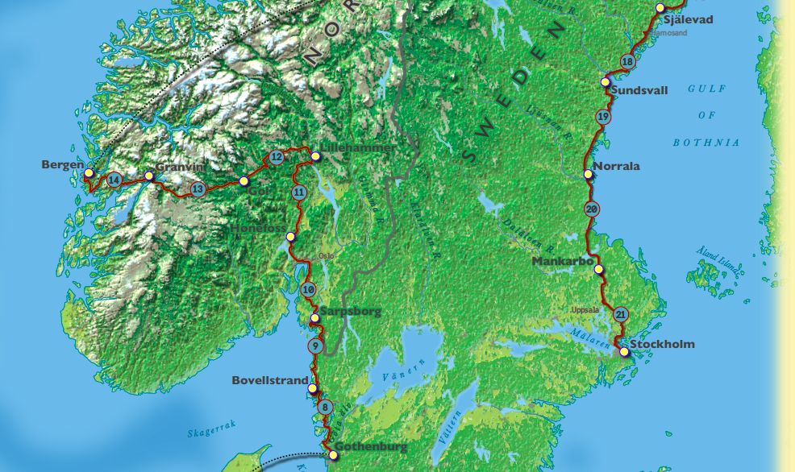

    

        

            <h4 class="modal-title">Tour of Scandinavia Promotional Poster</h4>
        

        

          

            

            
            

            

              <h4 class='text-muted page-header' align="center">Project Description</h4>

              
This is a map I made for my Cartographic Graphic Design class.  The map promotes a fictional bike race through Scandinavia, modeled on the well-known Tour De France stage race. Its visual hierarchy is dominated by the race course and the cities in which the stages start and stop.  My favorite part of the map, though, is the shaded relief basemap of the region, which is a beautiful representation of the terrain, and highlights the topography of Sweden, Norway, and Denmark.

              <h4 class='text-muted page-header' align='center'>Tools Used</h4>
              <ul>
                <li class='no-bullet'>ArcGIS</li>
                <li class='no-bullet'>Adobe Photoshop</li>
                <li class='no-bullet'>Adobe Illustrator</li>
                <li class='no-bullet'>Terrain Sculptor</li>
              </ul>
              <h4 class='text-muted page-header'><a href='../assets/ScottFarley_Lab2_final.pdf'>Finished Product</a> </h4>
            

          

